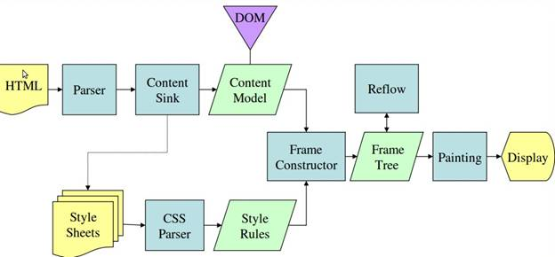

# 浏览器渲染机制

一直以来对浏览器的加载、解析、渲染过程等充满疑惑，网络上有许多优秀的文章，但比较杂，感觉没有一篇是适合我这么个前端小白的，所以自己写了这篇总结，希望能比较简单全面地梳理一遍整个流程或机制。

## 从用户输入URL开始

当用户输入URL并按下回车键的时候，计算机在底下进行了许多操作，下面比较简略地概括：

1. 解析URL字符串，并进行DNS查询，若计算机的host缓存已存在对应域名与IP地址的映射，则直接向服务器发出连接请求；否则先向DNS服务器查询目标服务器的IP地址
2. 与服务器建立TCP连接，并开始数据通信（一般是使用HTTP协议请求-响应的模式）
3. 一般的页面请求会先得到一个HTML文件（或文件的一个个小片段），浏览器会先根据html头部信息中的charset="xxx"字段知道页面是用什么编码方式的，然后逐个字符地解码并开启浏览器的渲染过程

这就是用户浏览网页的大致流程，当然，本文接下来重点探究的对象是第三点！

## 基本渲染流程

拿到html文件后，浏览器就开始自上而下解析、构建DOM树。过程中，当遇到CSS文件时，就并行加载与解析，生成CSSOM；当遇到图片等资源时，就并行下载资源；当遇到JS文件或代码时，则暂停DOM树的构建，等待JS代码或文件的加载与解析执行，这是因为JS代码可能会修改DOM，在JS执行完毕前，后续所有资源的加载可能是没必要的。解析完DOM和CSSOM后，浏览器引擎会通过DOM树和CSSOM树来构造渲染树（除去DOM中不可见的link/head等标签，并计算出各个标签元素的大小位置等），最后根据渲染树调用操作系统的GUI接口绘制出页面效果。

DOM与CSSOM的解析并不会相互阻塞。CSS文件的加载不影响JS文件的加载，但会阻塞JS的执行，因为JS可能会尝试获取DOM节点的样式属性，所以在JS执行前要保证CSS解析完。

各个浏览器引擎的这个渲染过程在实现上都会有所不同。如下，分别是webkit vs gecko引擎的主要流程图：

从两个引擎的渲染流程图可以看出，除了构建DOM/CSSOM/渲染树之外，还有Layout(Reflow)及painting两个步骤。

## 回流与重绘

正如上面的渲染流程所言，浏览器通过把html与css代码描述成DOM和CSSOM，并结合生成渲染树来渲染出各种美妙的页面，这个过程又主要由回流与重绘两个步骤完成。如下是一个比较经典的过程：

## 参考资料

浏览器加载：

- [浏览器~加载，解析，渲染](http://www.jianshu.com/p/e141d1543143)
- [研究首屏时间？你先要知道这几点细节](http://www.alloyteam.com/2016/01/points-about-resource-loading/)
- [从web浏览器的渲染到性能优化](http://blog.csdn.net/allenliu6/article/details/76609929)
- [深度剖析浏览器渲染性能原理，你到底知道多少？](http://www.jianshu.com/p/a32b890c29b1)

回流与重绘：

- [减少页面回流与重绘（Reflow & Repaint）](http://harttle.com/2015/08/11/reflow-repaint.html)
- [重绘，回流和合成，了解基本浏览器绘制帮你优化页面性能](https://zhuanlan.zhihu.com/p/23428399)