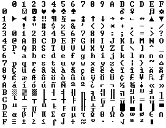

# 字符集编码、Unicode、web

在计算机内部，所有信息最终都是一串由0和1组成的二进制序列，包括各种自然语言文字。那么我们所看到的文字又是如何通过0101序列表示出来的呢？我曾经因为编码问题备受煎熬，对HTTP报文头部、HTML中的content-type或JSP中的一些编码属性一头雾水，稍有不慎就会使整个网页变为“??????”。为了彻底解决这些问题，现在就来一探究竟。

## 历史回顾 - ASCII

计算机是美国发明的，最初的计算机只能显示英文，而英文仅仅由26个字母加一些标点符号组成，使用7个位（bit）完全可以存储所有这些字符。那个时代的大多数计算机都是8位的，最大值达255，ASCII编码使用数字32到127来表示所有的英文字母与符号，比如空格是32（0010 0000）。所以使用ASCII不但可以存储全部，还能多出一位（默认最高位为0）。对于一个讲英文的国家而言，这一切已经足够完美了。有些厂商甚至可以利用多出来的一个位加入重音字符、水平线等符号。

由于厂商可以用多出的一位，即128到255的码字来表示不同的东西，就很容易产生混乱。这时又出现了ANSI标准，对于低128个码字无异议使用标准的ASCII，但对于高128个的码字，根据你所在地的不同，或计算机语言环境的不同，有不同的处理方式，这样相异的编码系统被称为码页（code pages）。举个例子，比如在以色列发布的DOS中使用的码页是862，而在希腊使用的是737。它们的低128个完全相同，但从128往上，就有了很大差别。MS-DOS的国际版有很多这样的码页，涵盖了从英语到冰岛语各种语言，甚至还有一些“多语言”码页。

这样的编码对于希腊语而言勉强够用了。至于亚洲国家的文字，使用的符号就多得多了，汉字多达10万左右。一个字节只能表示256种符号，肯定是不够的，必须使用多个字节表达一个符号。比如，简体中文常见的编码方式是GB2312，使用两个字节表示一个汉字，理论上最多可以表示256 * 256 = 65536个符号。

## Unicode

正如上一节所言，世界上存在着多种编码方式，同一个二进制数字可以被解释成不同的符号。因此，要想打开一个文本文件就必须先知道它的编码方式，否则就会解码出错，出现乱码。但是互联网的出现让字符串在计算机间移动变得非常普遍，而计算机间使用的字符编码可能又不一样，很容易爆发混乱。

Unicode是一个勇敢的尝试，它试图让一个字符集涵盖这个星球上所有书写系统。需要注意的是，Unicode只是一个符号集，它只规定了二进制代码，却没有规定这个二进制代码应该如何存储。事实上，Unicode使用一种与之前系统不同的思路来考虑字符。到现在为止，我们的做法是把一个字母映射到几个比特，这些比特可以存储在磁盘或者内存中。

    A -> 0100 0001

在Unicode中，一个字母映射到一个叫做码点（code point）的东西，这个码点可以看作一个纯粹的逻辑概念。至于码点在内存或者磁盘中的存储规则则由具体的实现方案来做了。

每一个字母系统中的每一个柏拉图式的（即抽象的意思）字母在Unicode中都被分配了一个神奇的数字，即码点。比如，U+0639表示阿拉伯字母“Ain”，U+0041表示英文字母“A”，U+4E25表示汉字“严”。其中，U+的意思就是Unicode，后面跟着的数字是十六进制的。事实上Unicode可以定义的字符数并没有上限，显然，并不是任何Unicode字符都可以用2个字节来表示的。

    eg. Hello -> U+0048 U+0065 U+006C U+006C U+006F

这些仅仅是一堆码点而已，或者说数字。

## 编码方式

只定义一个字符集是无法在计算机中存储的。Unicode最早的编码想法，就是把每个码点都存储在两个字节中，于是Hello就变成了：

    00 48 00 65 00 6C 00 6C 00 6F

但是下面这样也是可以的：

    48 00 65 00 6C 00 6C 00 6F 00

在技术上，两种方式都是可以的。事实上，早期的实现者们的确把Unicode的码点按照大端或小端两种方式存储（分别对应上面两个例子）。并且在一个文本文件或普通字符串的开头加上FE FF和FF FE来分别标识大端或小端的存储方式。这种传统的使用两个字节的存储方式称为UCS-2或者UTF-16（前者是后者一个子集，定长两个字节，而后者可以有四个字节）。

但是这种编码方式又会带来新的问题，就是对于英文母语的人来说，本来一个字母或符号只用单字节就可以存储了，放到UTF-16中至少需要两个字节存储，这是极大的资源浪费。这时非常聪明的UTF-8的概念被引入了。

UTF-8是一种变长的编码方式，可以使用1-4个字节表示一个符号，根据不同的符号而变化字节长度。其编码规则很简单：

1. 对于单字节的符号，字节第一位为0，后面7位为这个符号的Unicode码点。因此对于英语字母，UTF-8编码和ASCII码是相同的。

2. 对于n字节的符号（n > 1），第一个字节的前n位都设为1，第n + 1位设为0；后面每个字节的前两位均设为10。剩下没有提及到的二进制位全部为这个符号的Unicode码点。

Unicode符号范围（十六进制） | UTF-8编码方式（二进制）
---- | ---- 
0000 0000-0000 007F | 0xxxxxxx
0000 0080-0000 07FF | 110xxxxx 10xxxxxx
0000 0800-0000 FFFF | 1110xxxx 10xxxxxx 10xxxxxx
0001 0000-0010 FFFF | 11110xxx 10xxxxxx 10xxxxxx 10xxxxxx

随着互联网的发展，UTF-8编码已经成为最常用的编码方式了。我写程序都是用UTF-8的，包括这篇文章。

## 关于字符编码的唯一事实

如果你不知道一个字符串所使用的编码，这个字符串在你手中也就毫无意义。事实上，根本就不存在所谓的“纯文本”。

那么我们如何得知一个字符串所使用的空间是何种编码呢？如果是一份E-mail，你必须在格式的头部有如下语句：

    Content-Type: text/plain; charset="UTF-8"

对于一个网页，传统的想法是Web服务器会返回一个类似于Content-Type的http头与Web网页，注意，这里的字符编码并不是在HTML中指出，而是在独立的http响应headers中指出。这带来了一些问题，假设你拥有一个大的Web服务器，拥有非常多的站点，每个站点都包括数以百计的Web页面，而写这些页面的人可能使用不同的语言，他们在他们自己的计算机上的FrontPage（一种所见即所得的页面开发软件）等工具中看到页面正常显示就提交上来了，显然，服务器没办法知道这些文件究竟使用何种编码，当然正确的Content-Type头部也没有办法发送了。

如果可以把Content-Type夹在HTML文件中，那不是会变得非常方便？因为几乎所有的编码在32-127的码字都做相同的事情，即遵循ASCII，所以不需要使用特殊字符，我们可以从HTML文件中直接读取Content-Type:

    <html>
    <head>
        <meta charset="utf-8" />
    </head>
    <body></body>
    </html>

注意：这里的meta标签必须在head部分第一个出现，一旦浏览器看到这个标签就会马上停止解析页面，然后使用这个标签中给出的编码从头开始重新解析整个页面。如果浏览器在http头或者meta标签中都找不到相关的Content-Type信息该怎么办？纯靠浏览器猜咯。

## 参考链接

- [字符编码笔记：ASCII，Unicode 和 UTF-8](http://www.ruanyifeng.com/blog/2007/10/ascii_unicode_and_utf-8.html)

- [The Absolute Minimum Every Software Developer Absolutely, Positively Must Know About Unicode and Character Sets (No Excuses!)](https://www.joelonsoftware.com/2003/10/08/the-absolute-minimum-every-software-developer-absolutely-positively-must-know-about-unicode-and-character-sets-no-excuses/)

- [每个程序员都绝对必须知道的关于字符集和Unicode的那点儿事（别找借口！）](http://blog.csdn.net/x805433354/article/details/41448057)