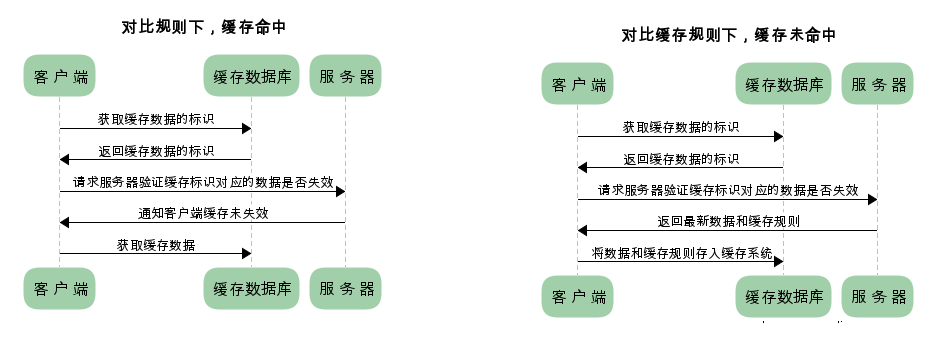

# HTTP缓存

HTTP缓存是Web性能优化的重要手段，在客户端一般指的是浏览器缓存，目的就是加速各种静态资源的访问，尤其是对于大型网站而言，同时还可以减轻服务器压力和网络带宽等问题。

但是HTTP缓存还可以在服务器端进行，比如代理服务器缓存或反射代理服务器缓存等，其中广泛使用的CDN服务器本质上也是一种服务器端缓存技术，只不过采用了一些走捷径的算法而已。另外，不仅仅HTTP，使用HTML meta标签也可以实现缓存，比如在<head>节点中加入：<meta http-equiv="pragma" content="no-cache" />可以告诉浏览器当前页面不被缓存，当然这些方法的使用场景或对浏览器的兼容性要求都不太友好。在这里主要以前端开发角度讲述HTTP请求过程中发生的缓存。

## HTTP缓存规则

HTTP协议是以请求-响应模型进行消息传输的，浏览器向服务器请求数据，发送请求（request）报文；服务器经解析后向浏览器返回数据，返回响应（response）报文。整个过程中始终只有两种报文在相互来往，即request与response，它们的内容主要分为两部分：包含属性的首部（header，cookie、缓存规则等信息），包含数据的主体（body，HTTP请求真正想要的内容）。

所以缓存主要由报文首部信息控制，浏览器第一次请求数据的流程图如下：

再次请求相同数据时：

仅仅看图，我们得知数据可以直接从缓存（本地硬盘）中读取，但有时又需要先向web服务器询问过后确定是从缓存中读取还是重新在服务器中拉取。

- 经浏览器判断后，无需服务器参与，直接从硬盘中读取的缓存方式，我们称之为强制缓存

- 需要服务器参与，无论本地缓存是否存在、是否命中都先需要询问服务器的缓存方式，称之为对比缓存

### 强制缓存

对于强制缓存来说，响应报文首部会有Expires或Cache-Control来标明失效规则。再次请求此资源时若缓存命中，我们可以在浏览器开发者工具中看到网络请求情况为“from disk cache”。

Expires的值是服务器端返回的到期时间，即下一次请求时，请求时间小于服务器端返回的到期时间，直接使用缓存数据。不过此属性是HTTP 1.0的东西了，现在的HTTP 1.1版本基本被Cache-Control替代了。它的问题主要是到期时间是由服务器生成的，但是对比到期时间与当前时间是在客户端进行的，而客户端时间与服务器时间有误差或格式问题，或客户端系统时间本身不准确，都会导致缓存命中的误差。

Cache-Control是最重要的规则了。常见的取值与意义如下：

Cache-Control取值 | 含义
---- | ----
private | 客户端可以缓存（默认）
public | 客户端与代理服务器都可缓存此数据
max-age=xxx | 缓存的内容将在xxx秒后失效
no-cache | 需要使用对比缓存来验证缓存数据
no-store | 所有内容都不会缓存，强制或对比缓存都不会触发

### 对比缓存

顾名思义，需要（与web服务器）比较判断是否可以使用缓存。浏览器第一次请求数据时，服务器会将缓存标识与数据一起返回给客户端，客户端将二者备份；再次请求相同数据时，客户端将备份的缓存标识发送给服务器，服务器要把缓存标识进行判断，若成功，返回304状态码，通知客户端比较成功并可以使用缓存，否则返回200状态码、新的缓存标识与相应的资源数据。

对于对比缓存，缓存标识的传递是需要着重理解的，它们在请求报文和响应报文间相互传递。而缓存标识又分为两种，下面分别介绍：

**Last-Modified / If-Modified-Since**

在服务器第一次响应请求时，用Last-Modified参数告诉浏览器资源的最后修改时间：

而浏览器再次请求资源时，通过If-Modified-Since字段通知服务器上次请求时，服务器返回的资源的最后修改时间。服务器收到后会把此字段的值与被请求资源的最后修改时间进行对比，判断返回304或200。

**Etag / If-None-Match**

规则与上一个相同，但是它们的值是一个唯一标识（生成规则由服务器决定，Apache中默认是对文件索引节、大小和最后修改时间进行哈希后的结果）。

那么既生Last-Modified何生Etag呢？
1. Last-Modified标注的最后修改只能精确到秒级，如果某些文件在1秒钟以内，被修改多次的话，它将不能准确标注文件的修改时间
2. 如果某些文件会被定期生成，当有时内容并没有任何变化，但Last-Modified却改变了，导致文件没法使用缓存
3. 有可能存在服务器没有准确获取文件修改时间，或者与代理服务器时间不一致等情形

## 优先级问题

其实从上面缓存规则的图就知道了，强制缓存 > Etag > Last-Modified，当然这里不需要再考虑Expires了。

## 参考资料

- [彻底弄懂HTTP缓存机制及原理](http://www.cnblogs.com/chenqf/p/6386163.html)

- [浏览器HTTP协议缓存机制详解](https://www.cnblogs.com/520yang/articles/4807408.html)