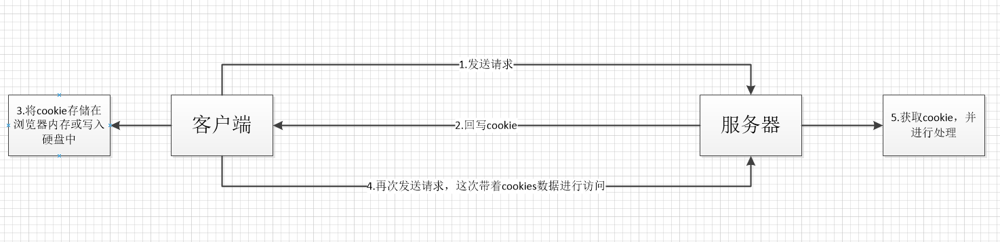
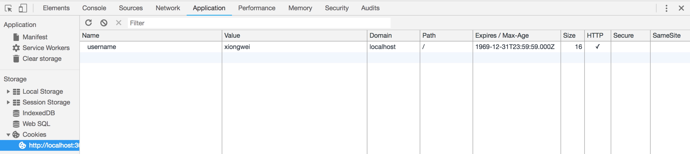

# Cookie

众所周知，HTTP是无状态协议，这意味着每个HTTP连接都是相互独立的，服务器端无法分辨每次请求分别来自哪个客户端。那么如果要让服务器知道一系列请求或操作的状态、来源等，该怎么做呢？最简单的就是使用Cookie了！

Cookie实际就是一组由服务器生成，保存在客户端（或浏览器）中的键值对罢了，当然它还包含着一些作用范围、有效期等信息。

## Cookie的应用流程

Cookie是如何实现由服务器生成，保存在客户端的呢？如上图所示：

1. 当客户端首次发送请求时，是不存在cookie的。如果服务器认为可以为这次请求生成cookie，那么服务器就会生成一个或一组cookie，并分别通过Set-Cookie字段写入到HTTP响应的报文头部
2. 客户端收到HTTP响应之后，就可以把cookie抽取出来，保存到本地
3. 当客户端（浏览器）再次向服务器发送请求时，将自动把符合规则、未过期失效的所有cookie写入到HTTP请求报文的头部的Cookie字段
4. 服务器收到cookie之后，就可以知道这个请求上一次是状态是什么了

目前大多数网站的登录态就是通过cookie配合session实现的。比如用户进入某个网站时，需要输入用户名、密码进行登录，此时还未存在任何cookie；当用户输入了正确的用户名和密码，而服务器验证通过之后，就可以在HTTP响应中加入username、uid等cookie用来表明此用户已登录；后续只要是带有这些cookie的HTTP请求，都认为是这个用户发出来的。当然这里还存在一些安全等问题，在此先不说这么多。

## Cookie属性

Cookie本质上是一组key-value对，但它们是有一定结构和属性的，如下图所示，通过Chrome浏览器查看站点localhost:3000所包含的cookie：

- Name、Value不必多说
- Domain: 指定cookie所在域名，可以是精确的如www.xiongwe.com，也可以是.xiongwei.com，后者将对所有子域名生效，若未指定此属性则默认为当前页面的域名。只有访问的域名能匹配Domain属性时，cookie才会被发送给服务器。此外，Set-Cookie时，Domain必须是所访问的域名或其“后缀”
- 

